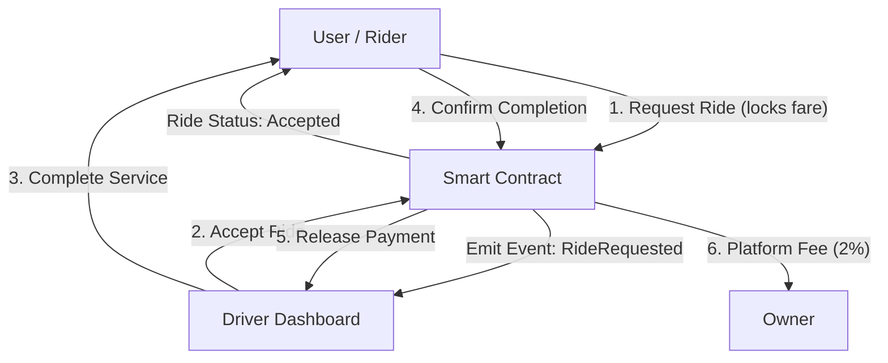

# 🚖 PolCab - Decentralized Ride-Sharing

**PolCab** is a next-generation decentralized ride-sharing platform built on the **Polygon Amoy Testnet**. It eliminates intermediaries by connecting riders and drivers directly via smart contracts, ensuring trustless payments, lower fees, and transparent trip data.

---

## 🏗️ Architecture

The system consists of a Next.js frontend and a Solidity smart contract. GPS and routing are handled off-chain for efficiency, while the core transaction logic (Booking, Acceptance, Payment) is secured on-chain.



---

## 🚀 Key Features

- **Trustless Payments**: Riders lock fares in the contract; drivers are paid automatically upon completion.
- **Low Fees**: Only 2% platform fee compared to 20-30% in traditional apps.
- **Decentralized Identity**: No sign-ups required; login with MetaMask.
- **Real-Time Updates**: Uses blockchain events to update driver/rider dashboards instantly.

---

## 📜 Smart Contract Flow (Snippets)

The core logic resides in `Polyber.sol`. Here is how the state machine works:

### 1. Data Structures
We use a `Ride` struct to track the lifecycle of each trip.
```solidity
enum RideStatus { Requested, Accepted, Completed, Cancelled }

struct Ride {
    uint256 rideId;
    address rider;
    address driver;
    uint256 fare;
    RideStatus status;
    string pickupLocation;
    string dropoffLocation;
    // ... Geolocation data (scaled integers)
}
```

### 2. Requesting a Ride
When a rider requests a ride, they send MATIC to the contract. This locks the funds until the ride is completed or cancelled.
```solidity
function requestRide(
    string memory _pickup, 
    string memory _dropoff,
    // ... coordinates
) external payable nonReentrant {
    require(msg.value > 0, "Fare must be greater than 0");
    
    rideCount++;
    rides[rideCount] = Ride({
        rideId: rideCount,
        rider: msg.sender,
        status: RideStatus.Requested,
        fare: msg.value,
        // ...
    });

    emit RideRequested(rideCount, msg.sender, msg.value, _pickup, _dropoff);
}
```

### 3. Accepting a Ride
Drivers listen for `RideRequested` events. A registered driver can accept a request, updating the status to `Accepted`.
```solidity
function acceptRide(uint256 _rideId) external nonReentrant {
    Ride storage ride = rides[_rideId];
    require(ride.status == RideStatus.Requested, "Ride is not available");
    
    ride.driver = msg.sender;
    ride.status = RideStatus.Accepted;

    emit RideAccepted(_rideId, msg.sender);
}
```

### 4. Completing & Paying
Once the rider confirms the destination is reached, the contract releases funds: 98% to the driver, 2% to the platform.
```solidity
function completeRide(uint256 _rideId) external nonReentrant {
    Ride storage ride = rides[_rideId];
    require(msg.sender == ride.rider, "Only rider can confirm completion");

    ride.status = RideStatus.Completed;
    
    uint256 fee = (ride.fare * platformFeePercent) / 100;
    uint256 driverPayment = ride.fare - fee;

    payable(ride.driver).transfer(driverPayment);
    payable(owner).transfer(fee);
}
```

---

## 🛠️ Tech Stack

- **Blockchain**: Polygon Amoy Testnet (fast & low cost)
- **Smart Contract**: Solidity v0.8.20, Hardhat
- **Frontend**: Next.js 14 (App Router), Tailwind CSS
- **Maps**: Leaflet.js, OpenRouteService (for routing & geocoding)
- **Web3**: Ethers.js v6

---

## 💻 Installation & Setup

### Prerequisites
- Node.js v18+
- MetaMask Wallet
- Testnet MATIC (Get from [Polygon Faucet](https://faucet.polygon.technology/))

### 1. Clone the Repository
```bash
git clone https://github.com/anuragdwivedi555/polcab1.git
cd polcab1
```

### 2. Deploy Smart Contract
```bash
cd blockchain
npm install

# Create .env file
echo "PRIVATE_KEY=your_metamask_private_key" > .env

# Deploy to Amoy
npx hardhat run scripts/deploy.js --network amoy
```
*Copy the deployed contract address from the terminal.*

### 3. Setup Frontend
```bash
cd ../frontend
npm install

# Configure environment
# Edit app/layout.tsx or a config file to set your CONTRACT_ADDRESS
```

### 4. Run Application
```bash
npm run dev
```
Visit http://localhost:3000 to start riding!

---

## 🌐 Deployment
This project is configured for seamless deployment on **Vercel**.
1. Push your code to GitHub.
2. Import the project on Vercel.
3. Set the **Root Directory** to `frontend`.
4. Deploy!

---

## 📄 License
This project is licensed under the **MIT License**.
